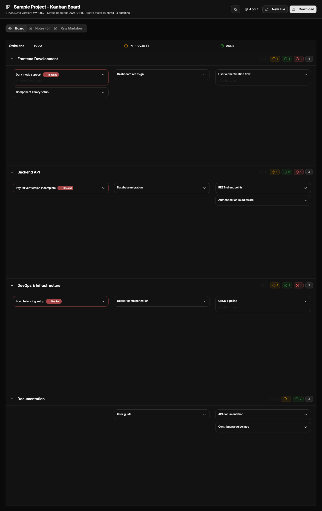

# MarkDeck

A focused Kanban board that visualizes `STATUS.md` files with round-trip safe editing and GitHub sync.



## Quick Start

**Install dependencies:**
```bash
npm ci
```

**Run Web UI:**
```bash
npm run dev
```

**Run Terminal Viewer:**
```bash
npm run build:tui     # One-time build
npm run markdeck-tui  # Run viewer
```

**Build for production:**
```bash
npm run build
```

## Key Features

- **Dual Format Support**: Works with both emoji-based (RYGBO) and simple checkbox formats
- **Simple Mode**: Two-column workflow (TODO → DONE) for checkbox-based lists
- **Full Mode**: Three-column workflow (TODO → IN PROGRESS → DONE) with blocked status modifier
- **Easy Upgrade**: Convert simple checkbox mode to full emoji mode with one click
- **Dark Mode**: Automatic theme detection with manual light/dark/system toggle
- **Deploy Badge**: Floating version chip (package version + commit hash) for Cloudflare builds
- Round-trip safe: preserves all non-card markdown when saving
- GitHub integration with personal access tokens
- Local file mode for offline work
- Drag-and-drop card movement
- Terminal viewer for quick status checks

## STATUS.md Format

MarkDeck supports two formats for creating Kanban cards:

### Simple Checkbox Format (2-column mode)

For basic TODO lists compatible with most markdown editors:

```markdown
- [ ] Task to do
- [x] Completed task
- [ ] Another task
```

This creates a simple 2-column board (TODO | DONE) perfect for quick checklists.

### Full Emoji Format (3-column mode)

For advanced project tracking with the RYGBO (5-color) status system:

```markdown
## Swimlane Heading
- 🟢 Completed task
    Optional indented description
- 🟡 In progress task
- 🔵 TODO task
- 🔴 Blocked TODO task
- 🟧 Blocked in progress task
```

**Note:** Any H2 (`##`) or H3 (`###`) heading creates a swimlane. Blocked cards remain in their column but are visually distinguished.

## Documentation

- **[STATUS.md](STATUS.md)** - Project roadmap and current status
- **[DEVELOPMENT.md](DEVELOPMENT.md)** - Developer guide: setup, architecture, testing, contributing

For troubleshooting and development instructions, see [DEVELOPMENT.md](DEVELOPMENT.md).
